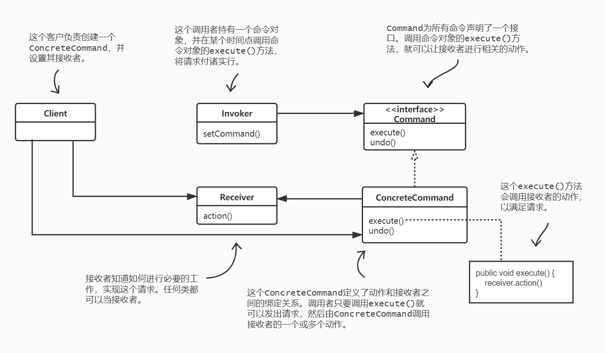

# 命令模式

## 定义命令模式

命令模式将“请求”封装成对象，以便使用不同的请求、队列或者日志来参数化其他对象。命令模式也支持可撤销的操作。

## 定义命令模式类图

## 命令模式的更多用途

1. 队列请求

   有这样一个工作队列：在一端添加命令，然后另一端是线程。线程进行下面的动作：从队列中取出一个命令，调用它的`execute()`方法，等待这个调用完成，然后将此命令对象丢弃，再取出下一个命令……

   **工作队列类和进行计算的对象之间完全是解耦的。**此刻线程可能在进行财务计算，下一刻却在读取网络数据。工作队列对象不在乎到底做些什么，它们只知道取出命令对象，然后调用其`execute()`方法。类似地，它们只要是实现命令模式的对象，就可以放入队列里，当线程可用时，就调用此对象的`execute()`方法。

2. 日志请求

   某些应用需要我们将所有的动作都记录在日志中，并能在系统死机之后，重新调用这些动作恢复到之前的状态。通过新增两个方法（`store()`、`load()`），命令模式就能够支持这一点。

   要怎么做呢？当我们执行命令的时候，将历史记录储存在磁盘中。一旦系统死机，我们就可以将命令对象重新加载，并成批地依次调用这些对象的`execute()`方法。

   有许多调用大型数据结构的动作的应用无法在每次改变发生时被快速地存储。通过使用记录日志，我们可以将上次检查点（checkpoint）之后的所有操作记录下来。如果系统出状况，从检查点开始应用这些操作。

   比方说，对于电子表格应用，我们可能想要实现的错误恢复方式是将电子表格的操作记录在日志中，而不是每次电子表格一有变化就记录整个电子表格。对更高级的应用而言，这些技巧可以被扩展应用到事务（transaction）处理中，也就是说，一整群操作必须全部进行完成，或者没有进行任何的操作。

## 总结

当需要将**发出请求的对象**和**执行请求的对象**解耦的时候，使用**命令模式**。

### 要点：

1. 命令模式将发出请求的对象和执行请求的对象解耦。
2. 在被解耦的两者之间是通过命令对象进行沟通的。命令对象封装了接收者和一个或一组动作。
3. 调用者通过调用命令对象的`execute()`发出请求，这会使得接收者的动作被调用。
4. 调用者可以接受命令当做参数，甚至在运行时动态地进行。
5. 命令可以支持撤销，做法是实现一个`undo()`方法来回到`execute()`被执行前的状态。
6. 宏命令是命令的一种简单的延伸，允许调用多个命令。宏方法也可以支持撤销。
7. 实际操作时，很常见使用“聪明”命令对象，也就是直接实现了请求，而不是将工作委托给接收者。
8. 命令也可以用来实现日志和事务系统。