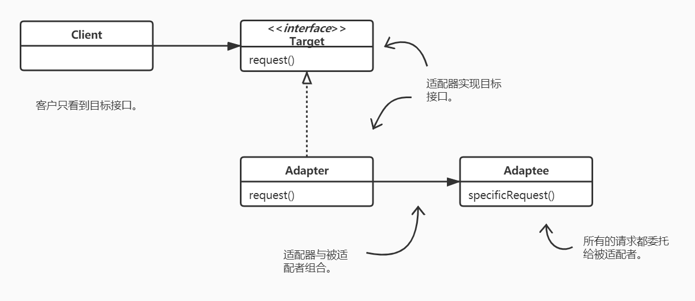

# 适配器模式与外观模式

## 定义适配器模式（Adapter-Pattern）

适配器模式将一个类的接口，转换成客户期望的另一个接口。适配器让原本接口不兼容的类可以合作无间。

## 定义外观模式（Facade-Pattern）

外观模式提供了一个统一的接口，用来访问子系统中的一群接口。外观定义了一个高层接口，让子系统更容易使用。

## 适配器模式VS外观模式

两种模式的差异，不在于它们“包装”了几个类，而是在于它们的意图。

- 适配器模式的意图是，“改变”接口符合客户的期望；
- 外观模式的意图是，提供子系统的一个简化接口。当然也将客户从组件的子系统中解耦。

## 总结

- 当需要使用一个现有的类而其接口并不符合你的需要时，就使用适配器。
- 当需要简化并统一一个很大的接口或者一群复杂的接口时，使用外观。
- 适配器改变接口以符合客户的期望。
- 外观将客户从一个复杂的子系统中解耦。
- 实现一个适配器可能需要一番功夫，也可能不费功夫，视目标接口的大小与复杂度而定。
- 实现一个外观，需要将子系统组合进外观中，然后将工作委托给子系统执行。
- 适配器模式有两种形式：对象适配器和类适配器。类适配器需要用到多重继承（Java中实现不了）。
- 你可以为一个子系统实现一个以上的外观。
- 适配器将一个对象包装起来以改变其接口；装饰者将一个对象包装起来以增加新的行为和责任；而外观将一群对象“包装”起来以简化其接口。