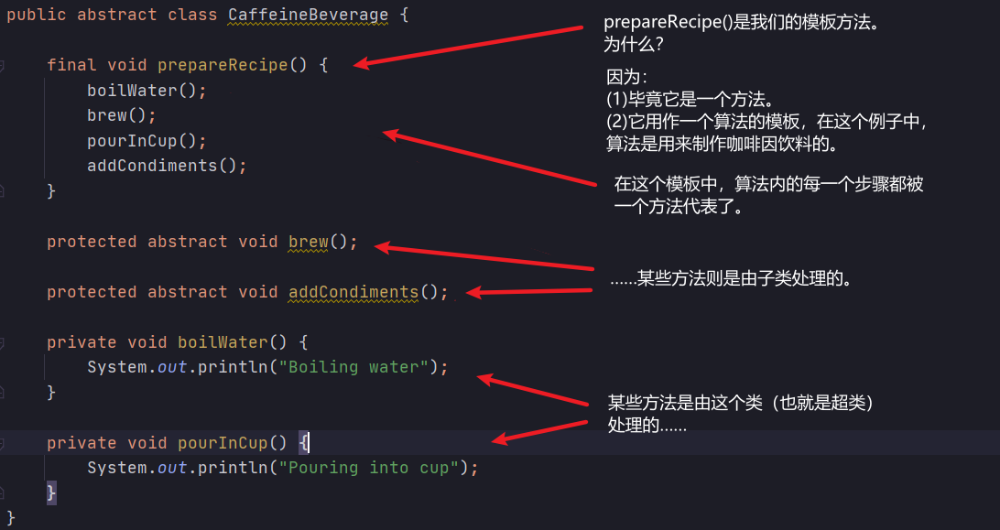
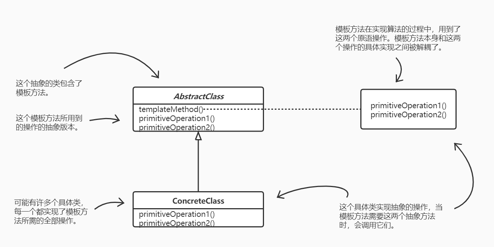

# 模板方法模式

## 认识模板方法
模板方法定义了一个算法的步骤，并允许子类为一个或多个步骤提供实现。

## 定义模板方法模式
模板方法模式在一个方法中定义一个算法的骨架，而将一些步骤延迟到子类中。模板方法使得子类可以在不改变算法结构的情况下，重新定义算法中的某些步骤。

## 好莱坞原则
别调用（打电话给）我们，我们会调用（打电话给）你。

在好莱坞原则之下，我们允许低层组件将自己挂钩到系统上，但是高层组件会决定什么时候和怎样使用这些低层组件。换句话说，高层组件对待低层组件的方式是“别调用我们，我们会调用你”。

## Java API 中的模板方法

- Arrays.sort()
- `java.io.InputStream`类的`read()`方法

## 总结
- “模板方法“定义了算法的步骤，把这些步骤的实现延迟到子类。
- 模板方法模式为我们提供了一种代码复用的重要技巧。
- 模板方法的抽象类可以定义具体方法、抽象方法和钩子。
- 抽象方法由子类实现。
- 钩子是一种方法，它在抽象类中不做事，或者只做默认的事情，子类可以选择要不要去覆盖它。
- 为了防止子类改变模板方法中的算法，可以将模板方法声明为 final。
- 好莱坞原则告诉我们，将决策权放在高层模块中，以便决定如何以及何时调用低层模块。
- 你将在真实世界代码中看到模板方法模式的许多变体，不要期待它们全都是一眼就可以被你认出的。
- 策略模式和模板方法模式都封装算法，一个用组合，一个用继承。
- 工厂方法是模板方法的一种特殊版本。