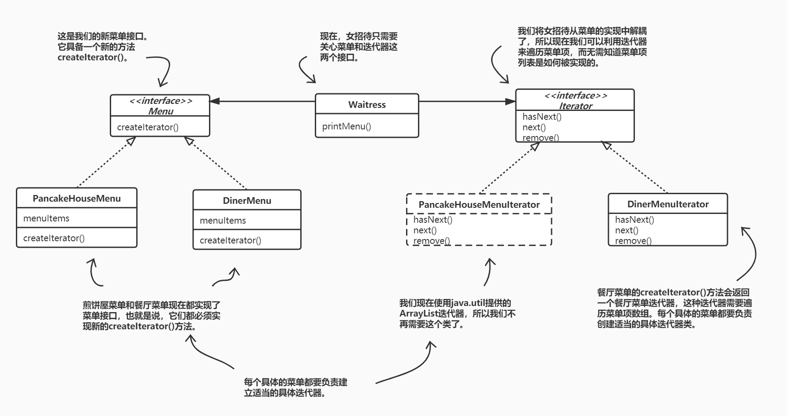
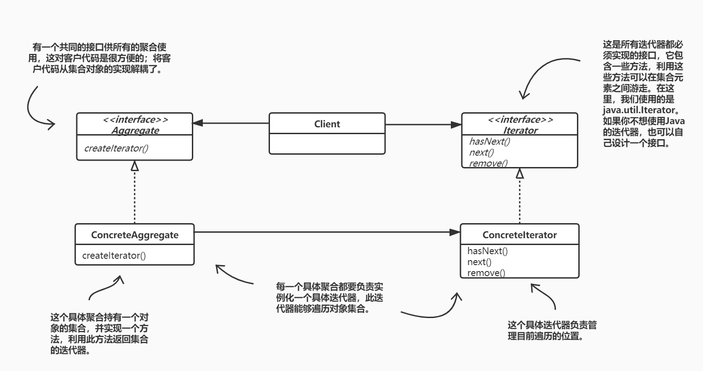

# 迭代器与组合模式



## 定义迭代器模式
迭代器模式提供一种方法顺序访问一个聚合对象中的各个元素，而又不暴露其内部的表示。



## 单一责任
- 类的每个责任都有改变的潜在区域。超过一个责任，意味着超过一个改变的区域。
- 这个原则告诉我们，尽量让每个类保持单一责任。

## 内聚（cohesion）
它用来度量一个类或模块紧密地达到单一目的或责任。

当一个模块或一个类被设计成只支持一组相关的功能时，我们说它具有高内聚；反之，当被设计成支持一组不相关的功能时，我们说它具有低内聚。

## Java 5的迭代器和集合
Java 5包含一种新形式的 for 语句，称为 for/in。

```java
for (Object obj : collection) {
    ...
}
```

## 定义组合模式
组合模式允许你将对象组合成树形结构来表现“整体/部分”层次结构。组合能让客户以一致的方式处理个别对象以及对象组合。

组合模式让我们能用树形方式创建对象的结构，树里面包含了组合以及个别的对象。

使用组合结构，我们能把相同的操作应用在组合和个别对象上。换句话说，在大多数情况下，我们可以忽略对象组合和个别对象之间的差别。

## 总结
- 迭代器允许访问聚合的元素，而不需要暴露它的内部结构。
- 迭代器将遍历聚合的工作封装进一个对象中。
- 当使用迭代器的时候，我们依赖聚合提供遍历。
- 迭代器提供了一个通用的接口，让我们遍历聚合的项，当我们编码使用聚合的项时，就可以使用多态机制。
- 我们应该努力让一个类只分配一个责任。
- 组合模式提供一个结构，可同时包容个别对象和组合对象。
- 组合模式允许客户对个别对象以及组合对象一视同仁。
- 组合结构内的任意对象称为组件，组件可以是组合，也可以是叶节点。
- 在实现组合模式时，有许多设计上的初衷。你要根据需要平衡透明性和安全性。